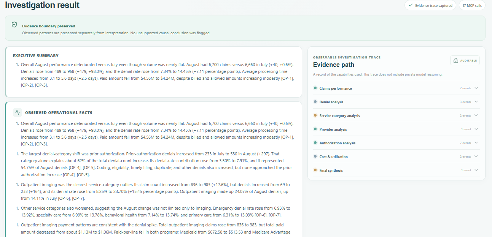
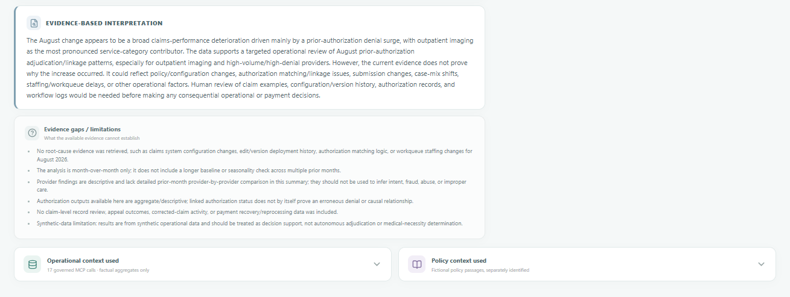

# Claims Intelligence AI

> **Governed healthcare claims investigation with agentic AI, MCP, RAG, deterministic analytics, and an observable evidence trail — built entirely with synthetic data.**

Claims Intelligence AI is a portfolio demonstration of how AI can help healthcare operations teams investigate claims-performance questions without turning the model into an autonomous decision-maker. The application combines deterministic claims analytics, a governed Model Context Protocol (MCP) layer, retrieval-augmented generation (RAG) over fictional internal policy, an OpenAI tool-calling investigation agent, and a React executive interface.

The core design principle is simple: **AI can help assemble and interpret evidence, but consequential healthcare decisions remain with people.**

## What this project demonstrates

- Natural-language investigation of claims performance and denial trends.
- Six governed, read-only MCP analytics capabilities backed by deterministic SQLite queries.
- RAG over a fictional internal policy corpus with passage-level provenance.
- Agentic tool selection across structured operational evidence and unstructured policy evidence.
- Explicit separation of observed facts, interpretation, policy context, and evidence gaps.
- An observable investigation trace without exposing private model reasoning.
- Synthetic-data, no-PHI, aggregate-only, human-decision-authority guardrails.

## Executive experience

The executive dashboard provides a business-first view of synthetic claims performance before an investigation begins. August 2026 metrics highlight denial rate, processing time, outpatient imaging denial rate, and denial volume, while the interface makes the synthetic-data and decision-support boundaries visible.


## AI-assisted claims investigation

Users can ask a claims-operations question in natural language. The investigation agent determines which governed capabilities are relevant, retrieves operational evidence through MCP, retrieves fictional policy passages through RAG when useful, and synthesizes the evidence into an executive-friendly response.

The response intentionally distinguishes **observed operational facts** from **evidence-based interpretation** and identifies what the available evidence cannot establish.



## Observable evidence and context

The application is designed to avoid a black-box experience. Each investigation exposes an observable evidence path showing which governed capabilities were used, while keeping hidden chain-of-thought private.

The UI can show validated MCP parameters, aggregate result previews, retrieved fictional policy passages, evidence gaps, and responsible-use boundaries. This provides a practical example of context engineering: supplying the model with the smallest relevant set of structured facts and policy evidence needed for the question rather than placing an entire database or policy corpus into model context.



## Architecture

```text
                         ┌──────────────────────────────┐
                         │   React / Vite Executive UI  │
                         └──────────────┬───────────────┘
                                        │ /api
                         ┌──────────────▼───────────────┐
                         │  Loopback Express API        │
                         │  validation + orchestration  │
                         └──────────────┬───────────────┘
                                        │
                         ┌──────────────▼───────────────┐
                         │ Claims Investigation Agent   │
                         │ OpenAI tool-calling loop     │
                         └─────────┬───────────┬────────┘
                                   │           │
                          Structured           Unstructured
                           evidence              evidence
                                   │           │
                    ┌──────────────▼───┐   ┌──▼────────────────┐
                    │ Governed MCP     │   │ Policy RAG        │
                    │ analytics tools  │   │ retrieval         │
                    └──────────┬───────┘   └──┬────────────────┘
                               │              │
                    ┌──────────▼───────┐   ┌──▼────────────────┐
                    │ Synthetic SQLite │   │ Fictional policy  │
                    │ claims data      │   │ documents/index   │
                    └──────────────────┘   └───────────────────┘
```

### Repository structure

```text
data/                 Local generated SQLite database (ignored by Git)
documents/            Fictional internal policy documents
src/database/         Schema, SQLite connection, deterministic generator, validation
src/tools/            Deterministic read-only analytics functions and verification
src/mcp/              Local stdio MCP server and protocol verification client
src/rag/              Policy ingestion, embeddings, index, retrieval, and verification
src/agent/            OpenAI tool-calling claims investigation agent and verification
src/http/             Loopback-only API for dashboard metrics and investigations
app/                  React/Vite executive investigation interface
docs/                 Data/design notes and portfolio screenshots
```

SQLite is the structured persistence layer. MCP is the governed interface to operational analytics. RAG is a separate unstructured evidence path for fictional internal policy. The agent can select capabilities from both paths while keeping operational facts and policy evidence separately identifiable.

## Responsible AI boundaries

This project uses **fictional synthetic data only**. It is not a clinical decision system and is not an autonomous claims adjudication system.

- Do not load real PHI, member identifiers, credentials, or live claims data into the demo.
- Treat observed relationships as associations requiring investigation, not proof of causation or wrongdoing.
- Keep humans responsible for clinical, coverage, payment, fraud, provider-intent, member-fault, and other consequential decisions.
- Operational analytics are read-only and population/member outputs remain aggregated.
- Retrieved policy passages are fictional internal examples, not CMS, Medicare, Medicaid, HIPAA, payer, legal, clinical, or regulatory requirements.
- The observable trace records tool and evidence use; it does **not** expose private model reasoning or chain-of-thought.

## Deterministic analytics layer

`src/tools/analytics.ts` provides six read-only, parameterized analytics functions:

- `getClaimsPerformance`
- `getDenialAnalysis`
- `getProviderPerformance`
- `getCostUtilization`
- `getAuthorizationAnalysis`
- `getMemberPopulationImpact`

The functions use allow-listed filters and return aggregated observations. They do not produce causal or wrongdoing conclusions. PMPM is intentionally not calculated because the synthetic dataset does not contain an enrollment-period/member-month denominator.

Run the analytics verification suite with:

```sh
npm run analytics:verify
```

## Governed MCP analytics

The local stdio Model Context Protocol server exposes exactly the six approved analytics functions to MCP-compatible applications. MCP provides a protocol boundary through which the investigation agent can discover and invoke governed capabilities without directly importing the database or analytics implementation.

Inputs use strict schemas, unknown fields are rejected, and there is **no arbitrary SQL tool**. Database access remains read-only.

```sh
npm run mcp:server
npm run mcp:verify
```

`mcp:verify` launches the MCP server, discovers its tools, exercises representative calls, compares results with direct deterministic analytics, and verifies that arbitrary SQL input is rejected.

## Fictional policy corpus and RAG

Six Markdown documents under `documents/` form the fictional internal operations policy corpus. Each is explicitly identified as:

> **FICTIONAL POLICY — CREATED FOR SYNTHETIC PORTFOLIO DEMONSTRATION ONLY**

RAG supplies relevant policy passages as a separate evidence source:

```text
Structured:   Claims Agent -> MCP -> deterministic analytics -> SQLite
Unstructured: Claims Agent -> RAG retrieval -> fictional policy documents
```

Policy ingestion identifies document titles and section headings, chunks content within sections, and retains filename/title/heading provenance. The configured embedding model is `text-embedding-3-small`. The local vector index is stored at `vector-indexes/policy-index.json` and is excluded from Git.

Retrieval embeds the question, computes cosine similarity locally, applies the configured similarity threshold, and returns only the top matching passages. Similarity is a ranking signal — not proof that a passage is authoritative or applicable.

```sh
npm run rag:index
npm run rag:verify
npm run rag:retrieve -- "What should happen when an authorization is pending?"
```

Rebuild the index after editing policy documents. Retrieved passages should always be inspected with their provenance before being used as decision support.

## Claims investigation agent

`src/agent/claims-agent.ts` implements an OpenAI Responses API tool-calling loop. At connection time, the agent discovers the MCP server tools and allows only the six approved analytics capabilities. Operational calls travel through MCP; `searchCompanyPolicies` remains a separate governed RAG capability.

The agent labels operational evidence as `OP-*` and policy evidence as `POL-*`, returns evidence-backed conclusions and evidence gaps, and records an observable tool/context trace. Guardrails reinforce non-causal language, aggregate-only population evidence, human review, and the principle that provider or authorization patterns do not establish wrongdoing or cause.

Run the synthetic investigation verification suite with:

```sh
npm run agent:verify
```

The suite exercises seven investigation scenarios, including claims performance, policy actions, service-category and authorization patterns, a provider accusation, AI decision authority, and an unrelated question. This command calls the OpenAI API and may incur API usage charges.

## Local executive web application

The React/TypeScript interface is a presentation layer over the governed agent. Vite serves the UI at `http://127.0.0.1:5180` and proxies `/api` to the Express server at `http://127.0.0.1:5181`. Both bind to loopback.

The browser has no SQLite connection, OpenAI SDK, embedding credential, arbitrary SQL capability, or direct analytics import. Dashboard metrics flow through MCP. Investigation questions are validated server-side before reaching the agent. The browser receives the final response, evidence gaps, observable call information, limited aggregate previews, and only the policy passages actually retrieved.

## Run locally

### 1. Install dependencies

```sh
npm install
```

### 2. Generate the reproducible synthetic database

```sh
npm run db:generate
```

To explicitly reset it first:

```sh
npm run db:reset
```

The default database is `data/claims.sqlite`. Generated SQLite files are excluded from Git.

### 3. Build the fictional policy index

Copy `.env.example` to `.env`, set `OPENAI_API_KEY` locally, then run:

```sh
npm run rag:index
```

The `.env` file and generated vector index are excluded from Git. Keep queries and documents free of PHI, live claim records, credentials, and unnecessary personal data.

### 4. Start the application

```sh
npm run dev
```

Open `http://127.0.0.1:5180`.

API health check: `http://127.0.0.1:5181/api/health`

Stop both services with `Ctrl+C`.

> **Windows PowerShell note:** If PowerShell execution policy blocks `npm.ps1`, use `npm.cmd` instead, for example `npm.cmd run dev`.

## Verification

The project includes separate verification paths for the deterministic data layer, MCP interface, RAG retrieval, agent behavior, TypeScript, and production build.

```sh
npm run typecheck
npm run validate
npm run analytics:verify
npm run mcp:verify
npm run rag:verify
npm run agent:verify
npm run build
```

`validate` reports row counts, month-level claims and denial metrics, denial categories, program comparisons, August provider concentrations, authorization-linked imaging outcomes, and foreign-key integrity.

## Trust boundaries

- **Browser:** presentation only; no database or OpenAI credentials.
- **Local API:** validates requests and orchestrates the existing governed agent.
- **MCP:** sole operational analytics path for the agent and dashboard.
- **RAG:** returns a limited number of fictional policy passages with provenance.
- **Model context:** receives only relevant aggregate evidence and retrieved passages rather than the full database or policy corpus.
- **Human authority:** remains responsible for consequential healthcare and claims decisions.

## Intended use

This repository is a **portfolio demonstration of governed AI architecture for healthcare claims operations**. It is intended to show how agentic AI, MCP, RAG, deterministic analytics, context engineering, and responsible-AI controls can be combined into a practical decision-support experience.

It is not intended for production healthcare use without additional security, privacy, regulatory, clinical, operational, infrastructure, and model-risk controls appropriate to the deployment environment.
